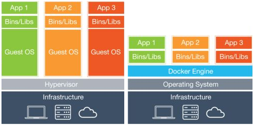

# 虚拟化技术分类

通常所说的虚拟化(Virtualization)技术，是指“计算虚拟化”，即为软件系统提供相互隔离的运行环境。

要实现隔离，目前有两种模式 ：虚拟机 和 容器。

+ 虚拟机(Virtual Machine) ：能实现从操作系统到用户空间的完全隔离

+ 容器(Conatiner)：只实现用户空间运行环境的隔离

借用Docker的一张图来说明：

--------------------

#### 虚拟机

--------------------

#### 容器
